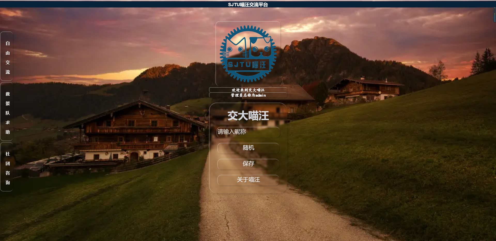

#  SJTU喵汪交流平台
1.  基于Websocket，前端vue，后端Node.js
2.  支持多人多房间聊天，前端做了pc端和移动端适应
3.  实现同一ip内设备访问，需要修改chatroom.vue中的ip（localhost）为本地ip。
4.  实现了自定义和随机登录名称，并且每个名称会绑定一个随机头像，再次输入相同的名称头像相同。
5.  尽可能尝试了课程中学到的优化和移动端设计技术，多采用flex、百分比高宽，让页面适应ipad、手机等场景。
6.  5.13更新：[部署在了阿里云上，点击链接](http://47.107.111.88:8080/)
7.  5.18更新：修复了css和头像问题，采用了更美化的页面设计，增加定制头像，在云服务器上适配本小组项目改为交大喵汪聊天室，使用admin作为昵称使用个性化头像。
8.  试用服务器，到期不可用请与我联系。
# 使用说明：
1. npm install 安装
2. 在根目录执行：node server.js启动服务器
3. 打开dist目录下的index.html，直接使用打包好的文件
4. 拆分终端，在根项目执行npm run serve，实现热更新
5. 使用npm run build打包（build后加载路径可能都少了"./"，可以提前修改vue.config.js中的publicpath为"./"）

# 开发过程
* 开发中的整体框架学习了GitHub上的好几个开源代码，最终仿制出一个比较粗糙的版本，实现了基本聊天功能，[见链接](https://github.com/sjtuLLWWTT/Chatroom-vue)  
* 继续开发，把一些开源代码中的功能结合到自己的代码中，成功加入了多房间选择、随机名称，聊天头像等功能。  
* 在多机器问题上，开源代码中基本都只实现本地本机登录，或者ipv6协议（看不懂），因此我学习了一些vue项目部署到局域网、服务器的博客和视频，尝试了将dist部署到华为云（但服务器有点贵，且弹性公网ip不太会设置），并且熟练掌握了在vue2，vue3框架下修改ip使得局域网内设备都可以访问的技术。集群和房间人数过多的问题不太会编程解决，我想到的思路是部署在多台服务器做总服务器，将原先的一台服务器以遍历的形式分发给所有客户端的任务根据性能分配到不同服务器上，在聊天平台设计中，对于一个大房间而言，接受任务是远小于发送任务的，因此可以用少量服务器接受，多台服务器发送，即一台服务器负责接受客户端信息并发送给所有发送用服务器，发送用的服务器分发给自己负责的客户端。另外长连接占用服务器资源较多，对于人数较多时应采取短链接。采用心跳周期断开长时间未响应或发送消息的用户是一种合理的设计。
* 开发过程中遇到了很多奇怪的bug，修bug的同时也更加熟悉了websocket、npm各种指令的原理，熟练了vue框架和路由，一开始用socket.io库，后来学习了使用原生websocket的代码，于是借用了他的设计，50行左右实现了服务端的基本操作，但是没有成功迁移他的心跳时钟（自动断线）设计。  此外很多开源设计中用数据库记录用户信息、消息等，时间所限，我并没有学习数据库的使用。
* 总之在开发的过程中，我从零开始探索vue框架，巩固了之前学到的前端知识，也锻炼了自己的编程能力（极大锻炼了debug能力），对于不熟悉的计网知识有了一些了解。虽然在debug和css布局上“浪费”了很多时间，但我感觉这次大作业还是让我收获很多的。  
* 经过探索，成功将项目部署在了阿里云，使用tmux挂载server进程和client进程，将打包好的文件用live-storage运行。
# 页面展示：登录页面

# PC端

# 移动端

#更新后 页面展示：登录页面

# 聊天窗口
